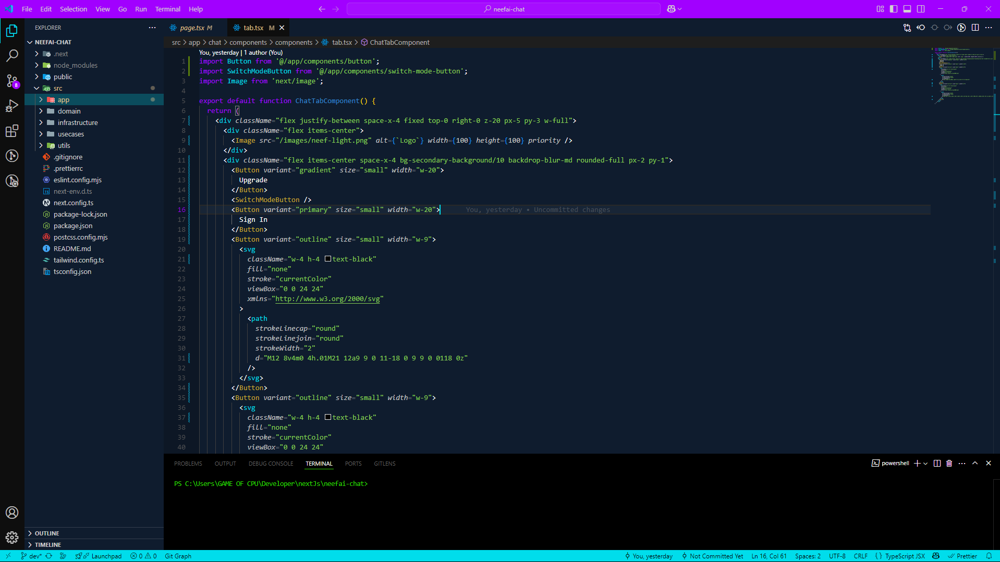
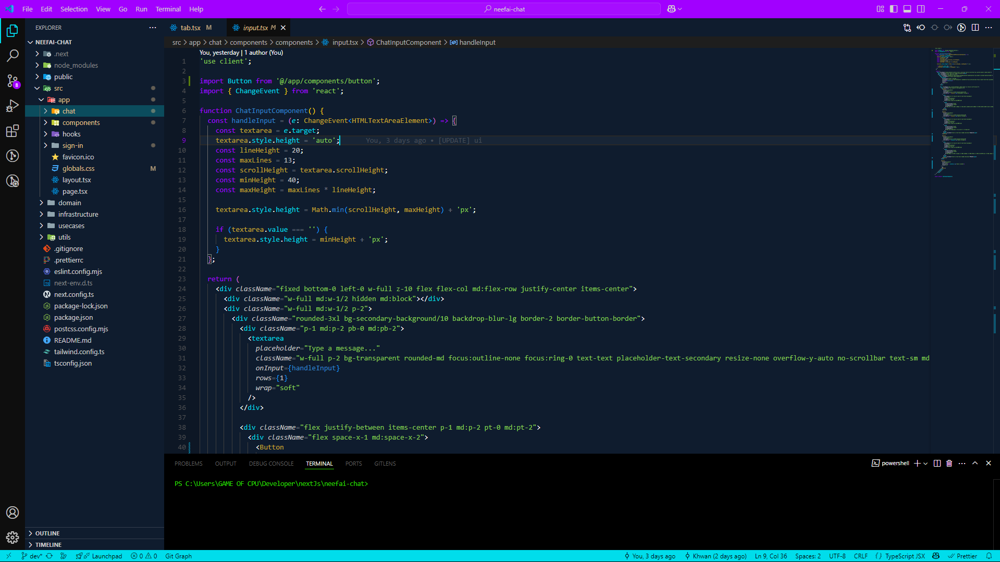

# Neef Color Theme

A beautifully designed color theme for developers. Perfect for creating visually appealing and consistent coding experiences.

## Features

- **High Contrast**: Ideal for readability in both light and dark environments.
- **Beautiful Color Palette**: Carefully selected colors to enhance your coding experience.
- **Cross-Platform**: Works seamlessly on macOS, Windows, and Linux.

## Getting Started

To get started with the **Neef Color Theme**, follow these steps:

1. **Install the Theme**  
   You can install the theme via the extension marketplace or manually from the repository.

2. **Activate the Theme**  
   Once installed, open **Command Palette** (`Ctrl+Shift+P` or `Cmd+Shift+P` on macOS), and search for **"Color Theme"**. Select **Neef Color Theme**.

## Screenshots

Here are some previews of the **Neef Color Theme** in action:

## Working with Markdown

You can author your README using Visual Studio Code. Here are some useful editor keyboard shortcuts:

- Split the editor (`Cmd+\` on macOS or `Ctrl+\` on Windows and Linux).
- Toggle preview (`Shift+Cmd+V` on macOS or `Shift+Ctrl+V` on Windows and Linux).
- Press `Ctrl+Space` (Windows, Linux, macOS) to see a list of Markdown snippets.

## For More Information

- [Visual Studio Code's Markdown Support](http://code.visualstudio.com/docs/languages/markdown)
- [Markdown Syntax Reference](https://help.github.com/articles/markdown-basics/)

## License

This project is licensed under the MIT License - see the [LICENSE](LICENSE) file for details.

---

**Enjoy!**
